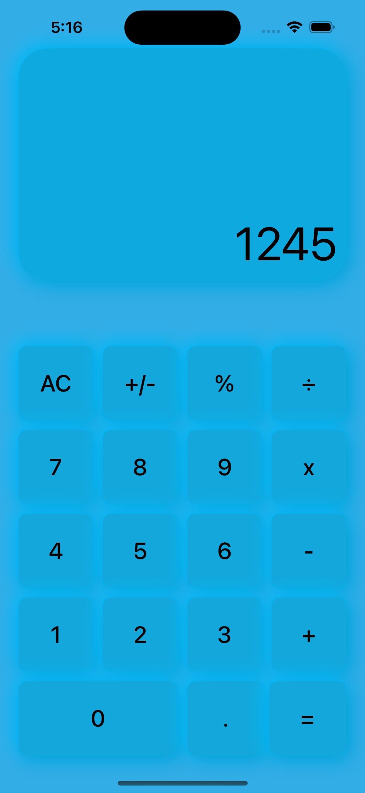
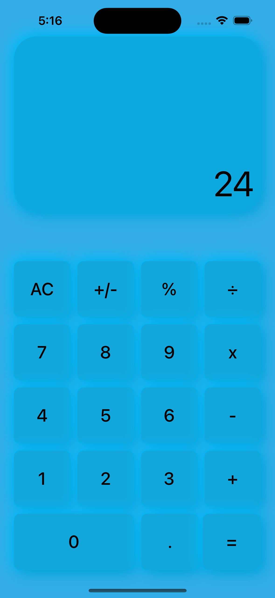

# Calculator

A simple calculator app that can only perform calculations with two numbers

Concepts learned: 
Tuples, Access Levels (private, fileprivate, public etc.), MVC

-----------------------------------------------------

 
 
 

